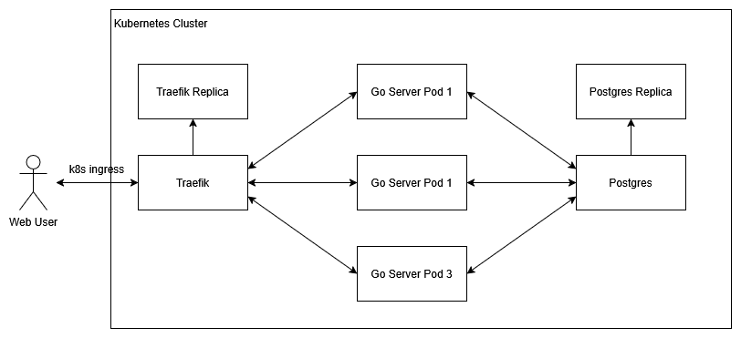

## About
---
A go application that can shorten URL. This works by generating a random short key for URL and saving the mapping in a database. When the user uses the short key, they are redirected to the URL that is mapped to that shortkey.

## Running development server
---
A `docker_compose.yaml` file has been made that allows for the application and the database to be quickly spun up. 
Run `docker compose -f docker_compose.yaml up` to the services. You might need build the application with docker first or provide the image package URL generated in this repository.

## kubernetes
---
The kubernetes release is based on the architecture below:


Traefik provides ingress into the Kubernetes service. It acts a reverse proxy and load balancer, directing all traffic to the go http server pods. Note it has a replica set in case the current pod fails, allowing Kubernetes to replace with minimal downtime.

Go http URL app manages the core logic of the whole application. It provides users with a friendly http website to the website users. If a metrics server is present on the Kubernetes clusters, we would be able to do horizontal pod autoscaling to traffic.

The Postgres database is used to store the shortkey to URL mappings. This is read the Go http server pods. We have replica on standby is we encounter any issues with the current Postgres pod.

### Installing using helm 
Before starting to ensure that `helm` is installed, along with a Kubernetes. I would recommend **minikube** as this works well with the Traefik load balancer.

#### 1. Create Namespaces
Create the following namespaces using these commands:
1. `kubectl create ns url-app`
2. `kubectl create ns postgres-database`

#### 2. Create application and database secrets
Create Kubernetes secrets by executing these commands:
```
kubectl create secret generic postgres-secret \
  --from-literal=POSTGRES_PASSWORD=mypassword \
  --from-literal=POSTGRES_USER=myuser \
  --from-literal=POSTGRES_DB=mydb \
  --namespace=database
```
Execute the same command but change the namespace to be url-app
```
kubectl create secret generic postgres-secret \
  --from-literal=POSTGRES_PASSWORD=mypassword \
  --from-literal=POSTGRES_USER=myuser \
  --from-literal=POSTGRES_DB=mydb \
  --namespace=url-app
```
I would change the secrets to be more secure. Just as an example.

#### 3. Deploy postgres database
To install the database:
  1. `helm install postgres-database helm/postgres-database`
  2. `kubectl get all -n postgres-database` to verify deployment and service creation

#### 4. Deploy url-app
To install the url-app:
  1. `helm install app helm/app`
  2. `kubectl get all -n url-app` to verify deployment and service creation

#### 5. Deploy Traefik
To install traefik:
  1. `helm instal traefik helm/traefik-reverse-proxy`
  2. `kubectl get all` to verify deployment and service creation
  3. `minikube tunnel` or equivalent to provide ingress to load balancer

#### 6. Loading site
Once all deployments are successful, visit `http://127.0.0.1/` in your browser to use the url-app.
